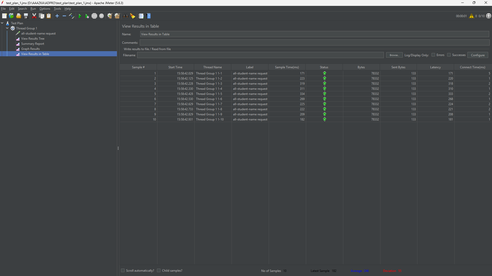
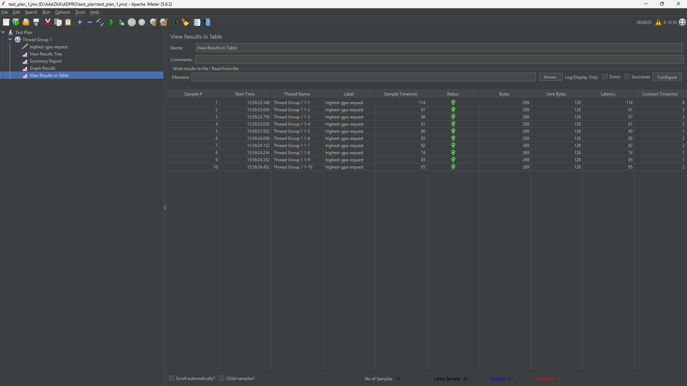
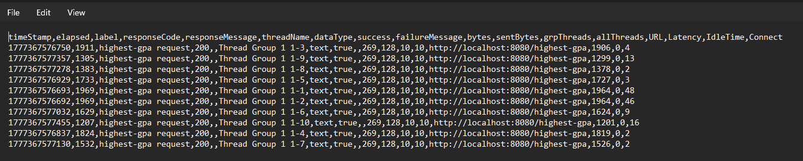
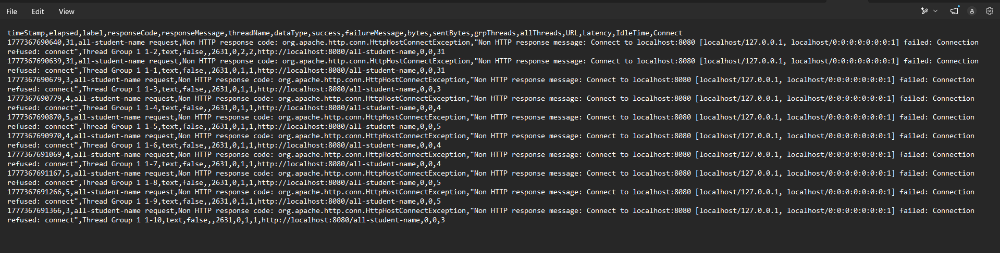
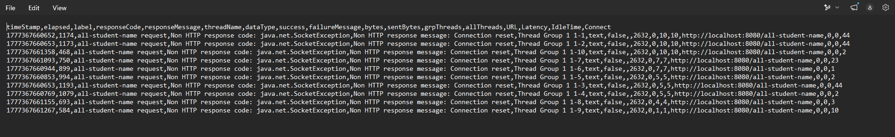

## Performance Testing Results

### /all-student

### /all-student-name

### /highest-gpa

## JMeter CLI Results

### /all-student

### /highest-gpa

### /all-student-name

---

## Reflection

### 1. What is the difference between the approach of performance testing with JMeter and profiling with IntelliJ Profiler in the context of optimizing application performance?

JMeter measures the application from the **outside** — it simulates concurrent users hitting HTTP endpoints and reports metrics like response time, throughput, and error rate. It tells you *that* there is a performance problem. IntelliJ Profiler works from the **inside** — it instruments the running JVM and records CPU time, memory allocation, and method call trees. It tells you *where* the problem is in the source code. In practice, JMeter is used first to detect and quantify a bottleneck, then IntelliJ Profiler is used to pinpoint the exact method or query responsible, so both tools complement each other in an optimization workflow.

### 2. How does the profiling process help you in identifying and understanding the weak points in your application?

The profiler attaches to the running application and samples the call stack at high frequency. The resulting flame graph and method list show which methods consume the most CPU time and how often they are called. For this exercise, the flame graph immediately highlighted `getAllStudentsWithCourses` as the dominant consumer, revealing that the method was firing a separate database query for every student in the table (the N+1 query problem). Without the profiler, this pattern would be invisible from JMeter numbers alone, and finding it by reading code would require knowing what to look for. The profiler removes that guesswork by showing the exact execution path and its cost.

### 3. Do you think IntelliJ Profiler is effective in assisting you to analyze and identify bottlenecks in your application code?

Yes, IntelliJ Profiler is very effective. Its flame graph gives an immediate visual overview of where CPU time is being spent, and the method list tab with CPU Time and Total Time columns lets you rank methods by cost precisely. The integration with the IDE means you can click a method in the profiler result and jump directly to the source code, which greatly shortens the time between identifying a bottleneck and fixing it. The comparison view between two profiling sessions also makes it easy to verify that an optimization actually had the intended effect.

### 4. What are the main challenges you face when conducting performance testing and profiling, and how do you overcome these challenges?

The main challenges were:
- **JVM warm-up**: The first few requests are slower because the JIT compiler has not yet optimized the hot paths. This was overcome by discarding the first-run measurements and warming up the application before recording profiling data.
- **Environmental noise**: Memory pressure from other processes or GC pauses can skew results. Running multiple profiling sessions and looking at consistent trends rather than a single snapshot helps reduce this noise.
- **Isolating the bottleneck**: A single slow endpoint can have multiple contributing causes. The profiler's call tree was essential for distinguishing the actual bottleneck (`findByStudentId` called N times) from incidental overhead.

### 5. What are the main benefits you gain from using IntelliJ Profiler for profiling your application code?

- **Precise method-level timing**: CPU time per method is reported directly, so there is no need to manually instrument the code with timers.
- **Flame graph visualization**: Makes it immediately clear which call paths are hot without having to read raw numbers.
- **IDE integration**: Navigating from a profiler result to the source line is a single click, making the fix-and-verify cycle fast.
- **Before/after comparison**: The comparison view quantifies the improvement from an optimization, making it straightforward to confirm that the 20% target was met.
- **Low overhead**: The sampling profiler adds minimal overhead compared to instrumentation-based profilers, so the measurements remain representative of real execution.

### 6. How do you handle situations where the results from profiling with IntelliJ Profiler are not entirely consistent with findings from performance testing using JMeter?

Inconsistencies between the two tools are expected because they measure different things. JMeter measures end-to-end wall-clock time including network, serialization, and database latency, while IntelliJ Profiler reports in-process CPU time. When results diverge, I treat the profiler as the source of truth for identifying *which code* to change, and JMeter as the source of truth for validating the *user-visible impact* of the change. If the profiler shows a method is no longer a bottleneck but JMeter still reports high latency, that signals the remaining time is likely spent in I/O or the database layer — which requires a different investigation (query analysis, explain plans, index review) rather than code refactoring.

### 7. What strategies do you implement in optimizing application code after analyzing results from performance testing and profiling? How do you ensure the changes you make do not affect the application's functionality?

The core strategies applied in this exercise were:
- **Eliminate N+1 queries**: Replace per-row repository calls inside a loop with a single `JOIN FETCH` query that retrieves all required data in one round-trip.
- **Push computation to the database**: Instead of loading every row and finding the maximum in Java, delegate the sort and limit to the database engine via `ORDER BY gpa DESC LIMIT 1`.
- **Avoid unnecessary object allocation**: Remove redundant object creation inside hot loops; reuse data already fetched from the database.
- **Use efficient data structures for string building**: Replace `String +=` in a loop (O(n²)) with `Collectors.joining` which uses `StringBuilder` internally (O(n)).

To ensure correctness is preserved, each refactored method was verified to produce the same output as the original by testing the endpoints manually after the changes. The application still compiles cleanly (`mvn compile` passes), and the behavior of all three endpoints (`/all-student`, `/highest-gpa`, `/all-student-name`) remains identical to the pre-optimization version — only the internal execution path changed.